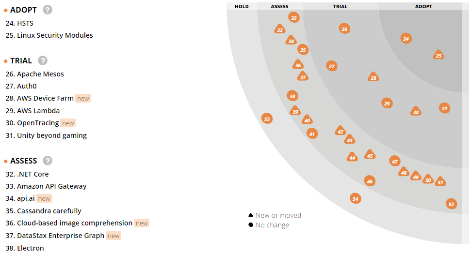
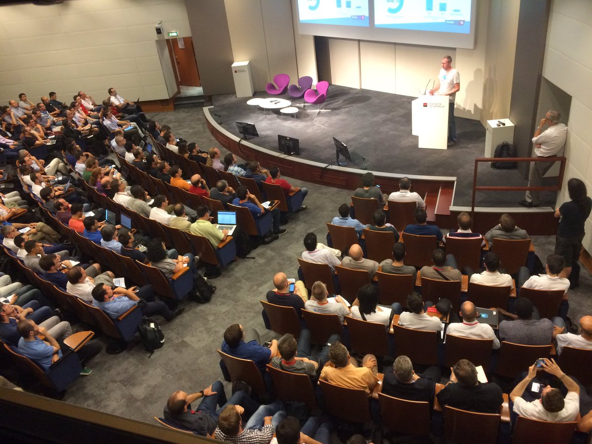

# Rendre les développeurs heureux en entreprise, c’est possible

## Les auteurs

### Cyril Lakech

Cyril Lakech est développeur et leader technique chez AXA France où il a pour mission d’animer la communauté des développeurs notamment.

### Romain Linsolas

Romain Linsolas travaille chez Société Générale comme leader technique d’une équipe élaborant les outils de développement d’applications web pour toute la banque d’investissement.

## Introduction

Reconnaissons-le, le développeur jouit d’une situation très enviable : il est courtisé de toutes parts. Le nombre d’offres d’emploi dans le monde du développement peut faire rougir de nombreux autres secteurs d’activité.
De l’autre côté du miroir — des entreprises donc — il devient ainsi compliqué de réussir à recruter les bonnes personnes, puis de les conserver au sein de leurs effectifs. Nous allons évoquer ici quelques pistes permettant aux entreprises de proposer un environnement agréable aux développeurs.

## Investir dès le recrutement

Le recrutement est la première image que l’entreprise donne au candidat, il est donc primordial que celle-ci soit bonne, sans quoi ce dernier vous ignorera tout simplement et passera à autre chose.
Il apparait qu’un mauvais recrutement est la deuxième cause d’échec d’un projet — la première étant son inutilité — alors autant prendre ce sujet avec le sérieux qu’il mérite.
La question se pose alors de savoir adapter le processus de recrutement aux besoins des développeurs. En voici quelques pistes.

* Il faut partager la vision et les objectifs de l’entreprise à moyen et long termes afin que le candidat puisse être en mesure de comprendre le contexte de l’entreprise, ainsi que de voir se dessiner les grands enjeux à venir. Il est nécessaire de partager les valeurs premières de l’entreprise, celles auxquelles on doit se raccrocher quand on doute, celles qui portent l’état d’esprit des collaborateurs au quotidien. Il est vital que le candidat se retrouve dans ces valeurs et consente y adhérer.
* Il faut décrire le cadre de travail et la façon dont s’organisent les équipes entre elles : quelle est l’ambiance de travail, quelles méthodes sont appliquées, quel est le fonctionnement classique des projets, et ainsi de suite. Le candidat doit être en capacité d’imaginer son travail au quotidien dans l’entreprise.
* Le sujet du salaire doit être abordé de manière ouverte. Il existe un marché dont les statistiques sont publiées régulièrement. Le salaire proposé doit être en adéquation avec ce marché et avec la mission. Cela semble évident, pourtant le sujet est généralement évoqué tardivement, et souvent de façon peu directe.
* Pour intéresser le développeur, rien de mieux que de parler du code, des pratiques mises en place, des outils, des langages et des technologies les plus répandus ou à l’étude. Il faut s’assurer que les souhaits de la personne sont en phase avec les pratiques de l’entreprise. Si l’entreprise pratique massivement les revues de code et les pratiques agiles, assurez-vous que les candidats acceptent ce genre de pratiques qui peuvent être déroutantes pour certaines personnes.
* Les *soft skills* sont un autre point sur lequel il apparait important d’insister lors de l’entretien. Au-delà des compétences techniques, de bonnes qualités humaines sont tout simplement indispensables. Concrètement, un développeur passera peu de temps à écrire du code, il sera bien souvent occupé à échanger et à collaborer avec d’autres personnes. Il devient alors critique de s’assurer au cours des entretiens que le candidat dispose bien de ces aptitudes.
* On pourra agrémenter le processus de recrutement avec un test technique ou du *pair programming* — c’est-à-dire de développer avec l’assistance d’une personne déjà en place au sein de l’équipe — afin d’avoir une mesure du niveau de maitrise technique du candidat. Ces épreuves sont parfois redoutées par des personnes un peu anxieuses, mais sont généralement appréciées par les candidats, ravis d’être évalués par un pair sur des cas concrets.

On le devine au vu de cette liste, il apparait important d’impliquer les développeurs directement dans le processus de recrutement, ceci afin de les engager et de les responsabiliser. Après tout, ce sont bien eux qui vont travailler avec les nouvelles recrues, alors autant s’assurer directement de leur compatibilité professionnelle. Rencontrer des développeurs durant ce processus est toujours bien perçu par les candidats, mais cela ne va pas sans inconvénients. Cela impose par exemple aux développeurs de l’équipe de passer du temps à réaliser ces entretiens, à en faire un suivi, et ainsi de suite. On peut le voir comme du temps perdu — car non imputé sur le projet pour lequel il travaille — mais sur le long terme, l’entreprise est tout de même gagnante, un bon recrutement étant un véritable investissement sur l’avenir.

On l’a évoqué, le marché est aujourd’hui très favorable aux développeurs, ces derniers sont de fait très sollicités par les entreprises en mal de talents. Si certaines d’entre elles vont jouer la carte de l’originalité pour sortir du lot, il faut faire attention à ne pas tomber dans les travers des offres farfelues, voire risibles, où l’on cherche des profils tout simplement impossibles. « Je recherche un ninja du digital en mode rock-star DevSecOps et évangéliste avec 10 d’expérience sur Kotlin pour un grand groupe international à l’esprit startup et à taille humaine ». Non seulement ce genre d’offre ne trouvera jamais preneur, mais elle aura surtout le mérite d’irriter le potentiel candidat et de vous décrédibiliser complètement. À proscrire absolument !

Une autre chose qu’il est préférable d’éviter consiste à faire coder un exercice ou un algorithme sur un tableau blanc en ayant la même rigueur qu’un compilateur. Non seulement cela ne mène à rien mais cela risque aussi de faire fuir votre candidat. Le tableau blanc reste une bonne idée s’il est utilisé pour démontrer la façon dont le candidat réfléchit et amène sa solution, éventuellement avec l’aide de pseudo-code.
Si votre souhait est de voir le candidat à l’œuvre avec du véritable code, il faudra se tourner vers des solutions telles que Codingame, actuellement utilisée chez AXA France et Société Générale.

*Codingame, une plateforme utile pour tester le niveau des candidats*

Quand cela est possible, on peut proposer au candidat de s’immerger directement dans l’équipe pendant quelques heures, de l’impliquer dans une séance de revue de code ou de *pair programming*. Arriver à faire passer ses premiers tests unitaires au vert avec le candidat, c’est une excellente manière de démarrer une collaboration efficace.

Une dernière chose, et non des moindres, il est important que les membres de l’équipe s’entendent bien avec le candidat sur un plan humain. Avoir dans son équipe une fameuse *rock star* du JavaScript, mais qui a un caractère invivable risque de poser plus de problèmes que de solution au sein de l’équipe. Proposer d’aller boire un verre peut être une manière informelle de s’en assurer, et cela aura aussi le mérite de mettre à l’aise le candidat.

Pour en finir sur le recrutement, un point crucial à respecter est la transparence et la franchise sur la société et l’équipe qu’il viendrait à rejoindre. Si, après quelques semaines ou quelques mois passés avec vous, il s’aperçoit d’une quelconque supercherie, cela risque de le décevoir, de le démotiver. Il existe alors un risque important qu’il quitte le navire, ce qui nous ferait tomber dans le travers dont on évoquait au début du chapitre, à savoir qu’un mauvais recrutement est extrêmement coûteux pour l’entreprise.

## Proposer un vrai plan de carrière

Il arrive que les développeurs s’ennuient et finissent par venir travailler simplement pour remplir le frigo.
Ce n’est souhaitable ni pour eux ni pour l’entreprise.
Il convient de leur offrir la possibilité de construire leur avenir afin de les fidéliser au sein de la société.
Nombreux sont les développeurs qui se sentent désengagés, déresponsabilisés dans leur travail, alors qu’ils pourraient être épanouis dans leur carrière — ce qui aurait également l’avantage non négligeable d’améliorer leur productivité.

Pour fidéliser le développeur dans l’entreprise, il faut lui proposer une expérience durable dans laquelle il va pouvoir évoluer dans le temps.
Il n’est plus question de considérer le métier de développeur comme une passerelle avant le métier de manager ou chef de projet.
Aujourd’hui, de multiples alternatives existent.

* Faire évoluer son niveau d’expertise technique, avec ses multiples paliers tels que novice, junior, sénior et enfin expert.
* Profiter de sa capacité d’influence et de leadership, par exemple pour occuper des postes d’évangélistes.
* Parfaire sa maîtrise des technologies complémentaires, telles que le développement web, *back-end* (avec Java, .Net, etc.), mobile, etc.
* Développer sa maîtrise des domaines métiers de l’entreprise.
* S’orienter vers des rôles d’architectes techniques ou fonctionnels.

Toutes ces évolutions du profil de développeur peuvent être clairement identifiées et valorisées dans l’entreprise, ce qui donne aux développeurs une vision long terme de leur carrière.
Cela est également utile pour l’entreprise afin de voir dans quels domaines et technologies il y a une carence ou une abondance de compétences au sein de ses effectifs.

L’une des manières les plus sûres pour obtenir l’attention des développeurs est de leur proposer de vivre des expériences extraordinaires. Il faut que leur quotidien soit varié, en alternant des projets stratégiques avec des projets innovants, ponctués parfois des projets plus classiques. Varier les plaisirs et casser la routine permettra aux développeurs de se sentir valorisés, et ainsi de les motiver davantage.

Un autre aspect à ne pas négliger est la formation, l’apprentissage. Pour paraphraser Damien Cavaillès — co-fondateur de JeChercheUnDev.fr : « Développeurs, apprendre est notre métier ».
Pour rester employable, un développeur doit apprendre sans cesse et suivre l’évolutions des technologies. Si l’on veut garder les développeurs et en attirer d’autres, il faut leur proposer une carrière où ils auront l’assurance d’être en mesure d’apprendre continuellement, de s’améliorer. Laisser assez de temps aux développeurs pour qu’ils puissent produire tout en apprenant devient alors un critère important à leurs yeux, sans quoi ils iront apprendre ailleurs, ou le feront en cachette sur le temps imputé aux projets sur lesquels ils travaillent. Dans de telles conditions, personne n’en sort gagnant !

À bien y regarder, il n’y a que deux possibilités.

* Soit l’entreprise investit sur la formation des développeurs. Cela représente bien entendu un coût — certains diront plutôt un investissement, mais aura en contrepartie l’avantage de créer un cercle vertueux où l’entreprise, les développeurs ainsi que les clients et utilisateurs s’y retrouveront au vu de l’amélioration notable de la qualité des productions.
* Soit l’entreprise n’investit pas dans la formation de ses développeurs. Ce choix stratégique va nécessairement impliquer à moyen terme une difficulté accrue à conserver les meilleurs éléments au sein des effectifs, et à rendre le recrutement encore plus difficile.

De leur côté, les développeurs doivent apprendre à apprendre, ce qui n’est pas aussi facile qu’il n’y parait.
Une manière intéressante et efficace de le faire est d’apprendre à enseigner.
Partager sa passion est souvent une caractéristique reconnue d’un bon développeur, mais cela a aussi de nombreux autres atouts.
Hubert Sablonnière (@hsablonniere sur Twitter), un développeur web et orateur apprécié, disait que de « donner des cours et des présentations a changé ma vie professionnelle. C’est un terrain d’auto-apprentissage inépuisable qui stimule les connaissances et savoir-faire liés à la technique mais aussi aux relations humaines. »
Quand les développeurs émettent ce souhait, il est primordial de les encourager à donner des cours, des présentations, des *Brown Bag Lunches*, tout en valorisant ce travail.

## Créer un environnement stimulant

La carrière du développeur étant désormais entre de bonnes mains, il faut maintenant s’affairer à lui proposer un environnement de travail qui soit propice à la concentration et à l’efficacité.
L’open-space, très présent dans les entreprises, n’est clairement pas adapté à ces contraintes : bruyant, source de déconcentration et de stress, généralement dépourvu d’âme, on lui préfèrera les bureaux flexibles.
Ces lieux viennent casser la routine créée par le bureau traditionnel en offrant des espaces adaptés aux besoins du moment.
On adoptera ainsi les petits espaces intimes pour suivre une conférence téléphonique sans être dérangé, on privilégiera les petites zones confortables pour les meetings en petit comité, et ainsi de suite.
L’intérêt des espaces de détente est aussi minimisé par les sociétés, alors qu’il s’agit là d’un lieu important, véritable exutoire pour le développeur qui aura passé une matinée entière à dénicher le bug dans son programme ! C’est aussi un lieu idéal pour souder les équipes, où chacun pourra mieux découvrir ses partenaires professionnels.

Si cette configuration des lieux est souvent la signature des géants du web ou des startups, les grandes entreprises commencent elles-aussi à s’y mettre, y voyant clairement un investissement incontournable et un atout séduction auprès de potentiels candidats à recruter.
À titre d’exemple, Société Générale a ouvert en 2016 ses nouveaux locaux à Val de Fontenay — « Les Dunes » — en respectant scrupuleusement cet état d’esprit.

*Les Dunes, nouveaux locaux de Société Générale*

L’espace de travail est lui aussi souvent mal considéré. Il ne suffit plus d’une simple chaise et un coin de table pour travailler.
Les développeurs pouvant passer près de dix heures par jour à leur poste, il devient primordial de leur assurer un confort certain, et ainsi de soigner leur santé.
À cet égard, on pourra opter pour le « bureau debout », offrant la possibilité de travailler aussi bien assis que debout et ainsi de changer régulièrement de posture de travail.
Il va de soi qu’une chaise de qualité ira de pair avec ce bureau.

Le télétravail est paradoxalement encore mal établi dans les grandes entreprises, alors que le métier du développement informatique s’y prête parfaitement !
C’est pourtant là un critère de plus en plus important lorsqu’un candidat cherche un nouveau poste, au point où cela représente, pour certains d’entre eux, un critère éliminatoire dans le cas où le télétravail serait interdit.
Nous n’allons pas retracer ici les nombreux avantages que procure ce mode de travail, mais ces derniers sont encore plus mis en exergue pour les métiers du développement : travailler chez soi offre un plus grand confort en partie grâce au calme, une meilleure concentration et donc une augmentation de la productivité.
Bien entendu, cela nécessite de la part du télétravailleur une certaine rigueur organisationnelle.
Il est primordial d’être en mesure de s’isoler, de créer un environnement spécifique afin de limiter les perturbations extérieures, mais également pour marquer — physiquement et psychologiquement — une véritable frontière entre le milieu professionnel et celui personnel.

Arrêtons-nous maintenant sur une pièce maîtresse et vitale du développeur : la machine.
Elle est fréquemment source de crispations : trop lente, trop limitée, peu adaptée au développement, mal configurée... les critiques ne manquent décidément pas !
Hormis l’aspect de la sécurité qui est très chère aux grandes sociétés, c’est très souvent le prix qui sert d’excuse pour ne pas fournir un matériel de meilleure qualité.
Pourtant un calcul très simple permet de montrer qu’il n’en est rien : si l’on considère qu’un prestataire est facturé 600€ par jour — ce qui correspond à un tarif tout à fait honnête sur la région parisienne, et si ce dernier vient à perdre une heure quotidiennement à cause de son matériel peu performant, alors la perte induite peut avoisiner les 15,000€ par an !
Admettons-le, même une excellente machine n’atteindra jamais de tels tarifs.

Cette même logique s’applique aux logiciels mis à disposition de ses développeurs.
Il est de plus en plus contre-productif d’imposer un logiciel unique à toutes ses équipes, on préfèrera opter pour une solution standard, tout en laissant le choix à chacun d’opter pour ses outils privilégiés.
Après tout, un développeur qui maîtrise parfaitement un outil risquera d’être perdu, et donc moins productif, si on vient à lui en imposer un autre.

Joël Spolsky, célèbre entrepreneur et co-fondateur de Stack Exchange et Trello, écrivait en 2000 le très connu "Test de Joël" [1] permettant à un candidat d’évaluer le niveau de qualité et de maturité de l’équipe de développement qu’il pourrait rejoindre.
Les règles huit et neuf de ce test résument parfaitement ce que nous venons de dire au cours de ce chapitre :

* Les programmeurs ont-ils un environnement de travail calme ?
* Disposez-vous des meilleurs outils que vous puissiez vous payer ?

Il ne faut donc pas faire l’économie d’un bon environnement de travail pour le développeur, ce dernier vous le rendra par une productivité et une motivation accrues !

## Le Software Craftsmanship à la rescousse

Un développeur veut pouvoir s’épanouir dans son travail et apprendre en permanence.
Comment l’amener à cet épanouissement ? Comment lui permettre de s’améliorer continuellement et qu’il puisse prendre conscience qu’il devient meilleur chaque jour ?
La réponse à ces questions tient en deux mots, le *Software Craftsmanship*, qui pourrait se traduire par le développement artisanal.

L’agilité semblait être la solution à tous les maux du développement logiciel, et s’il est vrai que cela a considérablement améliorer la situation, cela ne suffit plus.
L’agilité est souvent utilisée pour améliorer l’efficacité des livraisons et le résultat est que l’on se retrouve à livrer plus vite des applications parfois non fonctionnelles, défectibles et difficiles à maintenir.
Le *Software Craftsmanship* ne se définit pas comme un remplaçant de l’agilité, mais plutôt comme une extension à celle-ci, en rappelant que les logiciels doivent être bien conçus, et que chaque nouveau développement doit clairement apporter de la valeur au produit final.
Il rappelle également que les développeurs font partie d’une communauté de professionnels qui savent s’entraider, et que la relation avec le métier n’est pas simplement basée sur le mode client - fournisseur mais doit plutôt s’appuyer sur un partenariat vertueux.

Le *Software Craftsmanship* porte en soi une valeur importante, celle de l’idée que l’on doit être fier du travail réalisé collectivement et de l’apprentissage permanent.
Concrètement, de nombreuses pratiques peuvent être mises en œuvre, telles que le *TDD* (*Test Driven Development*), le *BDD* (*Behavior Driven Development*), la mise en application des préceptes du *clean code* (code propre) avec ses principes *DRY* (*Don’t Repeat Yourself*), *KISS* (*Keep It Simple, Stupid*) ou encore *SOLID* (acronyme représentant les cinq principes de bases de la programmation orientée objet).
L’envie ici n’est pas d’ajouter de multiples acronymes barbares sur son CV, mais plutôt de savoir adapter sa façon de travailler pour produire du code plus clair, plus expressif et à la maintenance facilitée.

Il faut beaucoup de persévérance pour créer une culture d’entreprise qui soit proche des valeurs et des pratiques du *Software Craftsmanship*.
Ce processus est long, mais à travers lui vous apprendrez beaucoup, la qualité de vos livrables s’améliorera et il sera alors difficile de revenir en arrière tant les bénéfices sont nombreux !

Richard Branson, fameux entrepreneur et fondateur de Virgin, a parfaitement résumé la situation qui nous intéresse ici, sans pour autant se limiter au monde de l’informatique, en disant ceci : « formez vos collaborateurs afin qu’ils puissent partir, mais traitez-les suffisamment bien pour qu’ils n’aient pas envie de le faire ».

## Travailler mieux, mais pour quoi ?

L’objectif du *Software Craftsmanship* est de produire du code avec une qualité toujours accrue, et cela est motivé en partie parce que la responsabilité du développeur est de plus en plus souvent engagée.
Aujourd’hui, la mise en production se fait souvent par les équipes mêmes qui ont développé le produit, ou à défaut en coordination directe avec eux.
Sans cela, il ne faut pas espérer les responsabiliser ; en cas de défaut, le développeur pourrait alors se décharger sur les opérateurs qui ont mis en production sa réalisation. Cette approche, mise en exergue par le mouvement *DevOps*, permet ainsi aux développeurs de voir les fonctionnalités dans leur ensemble, de l’idéation à l’utilisation du produit par les utilisateurs finaux.
Si cette approche permet de donner plus de responsabilité aux développeurs, elle offre également plus de visibilité à leur travail, ce qui ne manquera pas de les rendre fiers de ce qui a pu être accompli pour en arriver là.

Maintenant que les développeurs réalisent de belles applications qu’ils mettent eux-mêmes en production, il reste un dernier point et non des moindres : savoir donner du sens à leur travail.
Participer à une énième application de type *CRUD* ou une application sans intérêt risque de lasser les équipes qui y sont associées.
Il est important de noter à ce propos que la première cause d’échec des startups est justement de créer une application qui ne sert à rien, ou qui n’est utile à personne !
N’oublions pas non plus l’un des grands attraits de cette profession, à savoir qu’il est possible et aisé de travailler dans des domaines extrêmement variés : du domaine bancaire au domaine scientifique, en passant par les voyages, les services, aucun milieu n’est épargné.
Ne pas réussir à intéresser le développeur au métier sous-jacent, c’est prendre le risque de voir ce dernier quitter votre société par lassitude ou fatigue, afin d’aller vivre des aventures passionnantes ailleurs.

## L’ouverture technologique

Réussir à gérer les technologies utilisées dans l’entreprise d’une manière qui soit adaptée aux développeurs n’est pas chose facile. Ces derniers sont réputés comme des collectionneurs de langages, de frameworks et de plateformes.
Ils se lassent vite et ont souvent envie de tester les dernières évolutions à la mode.

Afin d’éviter un changement trop fréquent de technologies et pour limiter autant que faire se peut les dérives, des murs ont été érigés par nombre d’entreprises qui gravent dans le marbre ce qui est autorisé sur les projets et ce qui ne l’est pas.
Les développeurs se trouvent alors en grande difficulté dès que se présente le besoin d’utiliser de nouvelles solutions, et ce problème de communication entraine généralement des frustrations, voire dans certains cas extrêmes des démissions.
De telles limitations ne sont pas souhaitables tant l’écosystème du développeur évolue à grande vitesse, car le risque de se retrouver rapidement avec des choix technologiques dépassés est important.

La question se pose alors de savoir comment allier flexibilité et maîtrise des technologies utilisées.

Il existe un concept de radar technologique, rendu populaire par la société Thoughtworks[2] qui vient classer les technologies en quatre catégories que sont les langages de programmation, les outils, les plateformes et enfin les pratiques.
Chacune de ces catégories est ensuite divisée en quatre anneaux qui représentent un certain niveau de fiabilité et d’intérêt.
Cela commence au niveau de plus haute fiabilité, « *Adopt* », dénotant les techniques, outils, pratique et langages qui sont estimés comme pouvant être viables pour un déploiement en entreprise.
Viennent ensuite les niveaux « *Trail* », « *Assess* » et enfin « *Hold* ».

*La partie langages du radar de Thoughtworks*

Le concept derrière ce genre de radar peut être appliqué en fonction de la vision d’une entreprise et on peut alors publier la liste des technologies sous cette forme.
Il représente également un bon moyen de communiquer clairement sur la vision et l’usage des différentes technologies.

Bien entendu, ce radar a pour vocation d’évoluer, et pas simplement au bon vouloir de quelques décideurs.
Lorsqu’un développeur souhaite utiliser une nouvelle technologie, il prend contact avec un représentant de la communauté dédiée, par exemple la communauté web si l’on parle du dernier framework front-end à la mode.
Ensemble, ils prépareront une présentation de cette technologie à destination d’un collège de personnes ayant des profils divers et complémentaires au sein de l’IT de la société : architectes, opérateurs, responsables de la sécurité, développeurs ou experts dans un domaine en lien avec le sujet en question.

Le rôle de ce collectif est d’évaluer ce qui lui est présenté, en se posant les bonnes questions.
Quelles sont ses forces et ses faiblesses ?
Est-ce que cela présente des risques ou des opportunités ?
Quelle est l’expérience de la communauté avec cette technologie ?
Quels sont les coûts induits ?
Et ainsi de suite.

Si la technologie passe cette étape, elle peut être validée pour une seconde phase qui va la mettre en conditions réelles, sur un projet pilote par exemple.
Une fois ce dernier terminé — ou suffisamment avancé, un retour d’expérience est partagé avec ce même collège afin de dresser un bilan et de définir la prochaine évolution de cette technologie au sein du radar : soit elle est mise de côté car inadaptée ou présentant trop de risques, soit on la considère comme étant assez intéressante pour qu’elle puisse être utilisée sur d’autres projets.

Là encore, cette validation n’est pas figée dans le marbre.
Elle sera remise en question régulièrement, soit pour être déployée encore plus largement au sein de l’entreprise, soit pour être petit à petit dépréciée.

Cette méthode du radar technologique permet donc non seulement de communiquer largement et clairement sur les technologies utilisées dans l’entreprise, mais elle offre également la possibilité aux développeurs d’avoir une emprise sur celui-ci en y contribuant directement.

Il existe d’autres principes pour s’ouvrir aux évolutions des technologies.
Certains projets mettent en place des *feature teams*, mécanisme popularisé par la société Spotify.
Elles sont définies par leur petite taille — généralement autour de six à huit personnes — et par le fait qu’elles sont composées de talents complémentaires (développeur web, développeur *back-end*, testeur, analyste, etc.).
Dans une telle configuration, on pourra laisser libre chaque *feature team* de gérer ses propres langages, plateformes, outils et pratiques mais en leur imposant un certain niveau de qualité à atteindre, des APIs d’échanges à respecter ainsi que des règles de fonctionnement bien précises, telles qu’une parfaite intégration dans le reste du S.I., une documentation exhaustive et claire, un certain niveau de qualité et de support à respecter, etc.
Ce principe de fonctionnement est déjà en place chez certains géants du web.
Les équipes y gagnent en autonomie et en flexibilité mais il faut s’assurer du bon respect des règles de vie en communauté pour que la cohérence du SI reste gérable dans le temps sans devenir un point noir qui phagocytera les futures évolutions fonctionnelles.

## Créer des communautés

Une fois que l’on a décloisonné l’entreprise, il reste encore un besoin primordial à combler chez le développeur : pouvoir dialoguer avec ses pairs pour trouver de l’aide, aider les autres et contribuer aux besoins communs de sa communauté.
Un peu à l’image d’une famille sur laquelle on peut compter, les développeurs ont généralement cette envie de se regrouper avec d’autres développeurs ayant les mêmes appétences ou le même rôle qu’eux.
Il arrive que dans son équipe, un développeur soit le seul ayant un profil de développeur web par exemple. Vers qui pourra-t’il se tourner s’il a besoin d’aide et que ses collègues ne sont pas en mesure de l’aider ? Comment peut-on confronter ses idées à d’autres experts du même domaine ? StackOverflow est-il la seule voie ?

Créer des communautés de pratiques dans l’entreprise améliore la solidarité entre équipes et apporte de la cohérence dans le système d’information en augmentant l’intelligence collective dans le domaine de chaque communauté et en incitant à la réutilisation de composants communs.
En contrepartie, cela implique une certaine organisation à mettre en place.

Les exemples de communautés ne manquent pas, et il est préférable de laisser les développeurs créer les communautés dont ils ont besoin.
Ainsi, on pourra en créer autour des technologies comme Java, .NET, le développement *front-end*, le dévelopement mobile, NodeJS ou encore autour des pratiques comme *Crafts(wo)manship*, API ou enfin autour des rôles tels que leaders techniques, Scrum Masters, etc.
Toute initiative de création de communauté doit être encouragée, la seule chose qui importe étant qu’elle soit utile aux développeurs et qu’elle soit vivante !

La mise en place de ces communautés nécessite un cadre, une vision et des valeurs pour qu’elles s’inscrivent dans le plan d’évolution de l’entreprise afin d’y contribuer pleinement.
Il faut en premier lieu identifier des volontaires et des leaders pour démarrer et animer les communautés.
Pour faire vivre ces dernières, ils vont avoir besoin de temps et d’espace pour échanger, se retrouver, collaborer.
Dans ce but, les participants pourront disposer de quelques heures par mois pour suivre une communauté, voire davantage afin d’y contribuer activement.
Il serait vain de leur demander d’y contribuer sur leur temps libre, uniquement pendant la pause déjeuner, le soir ou les week-ends.
Des « BOF » (« *Bird of a Feather* »), des points de rencontres réguliers entre membres d’une même communauté pourront être organisés pour partager des présentations, débattre de sujets stratégiques, prendre des décisions, définir des bonnes pratiques ou toute autre tâche nécessaire à la vie du groupe.
Dans un but d’efficacité, on pourra leur mettre à disposition des outils collaboratifs tels que Github, Confluence, Slack ou encore JIRA pour aider les communautés à construire, à partager et à s’organiser.

Un exemple concret : actuellement, la communauté NodeJS d’AXA réalise un kit de démarrage qui aidera les équipes en charge de créer de nouveaux projets avec ce type de technologie.
Ce kit consiste en une application blanche prête à être intégrée dans le système d’information de l’entreprise, comprenant les bonnes pratiques de développement, pré-configurée pour être déployée dans le cloud d’AXA et comprenant des composants transverses de *log*, de diagnostic, de surveillance, et ainsi de suite.
À terme, cela va faciliter le déploiement de NodeJS et permettre d’augmenter le nombre de projets qui utilisent cette plateforme.

## Contribuer à l’open-source

L’open-source est un fondamental dans le développement logiciel.
Les développeurs y sont particulièrement attachés, leur travail a toujours été grandement facilité par l’incroyable richesse des solutions open-source, certains d’entre eux y participent même très activement.
Si les entreprises basent nombre de leurs projets sur des solutions issues de cette communauté, le voyage inverse, qui consiste pour ces entreprises à y contribuer en retour, est souvent moins fréquent.
Pourquoi ? Les principaux freins à cette contribution sont d’abord liés à des considération de sécurité : il y a toujours une certaine frilosité à vouloir sortir du code, et il devient parfois nécessaire de mettre en place des mécanismes pour s’assurer qu’il n’y a aucune fuite de données critiques.
Mais ce sont également des contraintes légales qui sont parfois opposées à ces contributions : à qui revient la propriété intellectuelle de la contribution ? Comment gérer le cas d’une équipe composée en partie de prestataires appartenant donc à une autre société ?

Malgré ces obstacles, la participation d’une entreprise à l’open-source est très bénéfique.
C’est avant tout un formidable vecteur d’apprentissage.
En étudiant le code développé par d’autres personnes, on apprend de nouvelles approches, de nouvelles techniques.
En montrant le code que l’on produit à d’autres, on apprend également par les retours, les corrections et les commentaires qui sont faits à son endroit.

C’est aussi un bon moyen de faire évoluer ses produits grâce aux contributions externes.
Si cet aspect revêt un caractère éminemment positif, cela peut s’avérer chronophage : il faut prendre du temps pour analyser les *Pull Requests* (les contributions faites par des personnes extérieures à l’équipe), mais également pour en assurer le support.
Fort heureusement, il existe de nombreux mécanismes automatisés pour faire un premier tri parmi ces contributions, comme ces robots dédiés à scanner le code afin de s’assurer du bon respect des conventions de codage, de l’écriture des tests, et ainsi de suite.

C’est enfin une piste de recrutement à ne pas négliger.
Si une entreprise participe activement au développement d’une solution open-source, elle va nécessairement attirer l’attention des personnes ayant recours à cette solution, et potentiellement les intéresser à rejoindre la compagnie.
À l’inverse, une société peut détecter des contributeurs importants sur les solutions open-source stratégiques pour elle et tenter de les recruter. Bien entendu, dans pareilles circonstances, le candidat en question sera très vigilant sur la façon dont la société contribue à l’open-source.
Vouloir recruter un contributeur à l’open-source puis lui refuser le droit de continuer ses activités une fois au sein de l’entreprise n’aurait en effet aucun sens, et le recrutement évidemment voué à l’échec !

S’il est compliqué dans un premier temps de contribuer à l’open-source, une alternative devrait toutefois être tentée, celle de l’*inner-source*.
Il s’agit d’appliquer les pratiques et la notion du partage de l’open-source, mais au sein de l’entreprise, le code restant alors cloisonné au sein du système d’information de celle-ci.
Différents outils peuvent être utilisés dans ce but : Github Entreprise, des repositories privés sur Github.com, GitLab, etc.
L’important est de partager le code produit par son équipe au sein de toute l’entreprise.
Même si le public touché est bien moindre qu’au travers de l’open-source, les bénéfices d’apprentissage cités précédemment restent valides.
C’est également un excellent moyen d’éviter la redondance de développement, puisqu’on évitera ainsi plus facilement de créer une fonctionnalité qui aura pu être développée précédemment par une autre équipe.

## Participer à des événements

La notion de partage est extrêmement forte dans le monde du développement informatique.
Il suffit de voir le nombre de conférences qui existent pour s’en convaincre : rien que sur la région parisienne, ce sont des dizaines de conférences, de rencontres, de réunions ouvertes qui ont lieu chaque semaine.
Les entreprises ont leur rôle à jouer à ce niveau-là, aussi bien pour leur profit que pour celui de leurs collaborateurs.

Le *Brown Bag Lunch* — ou plus simplement *BBL* — représente le moyen le plus accessible d’apporter la connaissance au sein d’une société [3].
Le concept est très simple et peut se résumer ainsi : on invite un(e) expert(e) le temps du déjeuner pour venir réaliser une présentation technique dans son domaine.
Le terme de *brown bag* fait à ce propos référence au fameux sac en papier marron que l’on utilise pour transporter son déjeuner sur son lieu de travail.
Pour l’hôte — et donc la société, les avantages sont multiples : cela représente une veille technologique très accessible, très variée tant les sujets proposés lors des BBL sont vastes et cela permet à ses collaborateurs de découvrir de nouveaux langages, outils ou méthodes de développement.
Pour l’expert(e), aussi appelé(e) *bagger*, c’est l’opportunité de se faire connaître, de rôder une présentation — utile pour la répéter en amont d’une conférence  — ou encore d’exercer ses talents d’orateur, ce qui est plus facile à faire en petit comité d’une dizaine de personnes que face à un auditoire de trois cents participants.
Si vous êtes intéressés par ce type d’événements, il suffit de vous rendre sur le site recensant toutes les personnes disposées à présenter des sujets sur ce format de BBL, http://www.brownbaglunch.fr. Ce ne sont pas moins de 250 femmes et hommes sur tout le territoire français qui s’y sont déjà inscrits !

Un autre moyen pour les entreprises d’avoir une part active au sein des communautés est l’hébergement de meetups.
Un meetup, qui doit son nom au site Internet éponyme, est le rassemblement récurrent de passionnés autour d’un sujet.
Si les meetups eux-mêmes sont gérés par des communautés dédiées, ce sont les entreprises qui les hébergent.
Petites startups ou grosses entreprises, c’est un moyen simple de s’offrir de la visibilité auprès d’un ensemble de personnes ayant un attrait commun.
Sur la place parisienne, il y a plus de cent meetups dédiés à la technologie qui rassemblent au moins mille inscrits chacun. De quoi largement trouver son bonheur !

*Meetup Docker hébergé chez Société Générale*

Les hackathons sont très en vogue auprès des entreprises.
Chaque année des dizaines d’événements de ce type sont mis sur pied à destination des développeurs, des entrepreneurs et des innovateurs.
Un hackathon est un concours de développement collaboratif qui met en concurrence une dizaine d’équipes en moyenne pendant un, deux ou trois jours.
Les entreprises qui mettent en place ce type d’événements donnent généralement un thème ou certaines contraintes aux candidats, par exemple le fait d’utiliser les *API* publiques de la société.
Au terme du hackathon, les équipes présentent leurs réalisations à un jury, qui finit par élire les projets gagnants.

Si les hackathons ont clairement un intérêt pour les entreprises, il est très important que ces dernières offrent une véritable compensation aux participants.
Considérer les hackathons comme de la main d’œuvre pratiquement gratuite risque de créer l’effet inverse de celui escompté, et ainsi de mettre la société dans une situation délicate.
Pour éviter ce fameux effet *bad buzz* il est préférable de prévoir des récompenses de valeur pour les participants, l’idéal serait même d’être en mesure d’incuber une poignée de projets pour leur permettre de concrétiser les projets qu’ils auront ébauchés lors de l’événement.

Un autre type d’événement qui intéresse beaucoup les développeurs est la conférence interne.
L’entreprise organise un événement — généralement sur une journée — essentiellement à destination de ses collaborateurs.
C’est l’occasion d’intégrer les membres nouvellement recrutés en leur imprégnant les valeurs de l’entreprise, de faire découvrir de nouvelles technologies, de lancer de nouvelles carrières d’orateurs...
Bref, beaucoup de bonnes choses, mais qui représente cependant une certaine complexité d’organisation et un prix non négligeables.

S’il n’est pas toujours facile de monter sa propre conférence interne, une dernière approche bien plus accessible consiste à sponsoriser des événements, des conférences.
Le métier du développement informatique jouit en effet d’une chance rare qui est le grand nombre de conférences sur de nombreux thèmes.
Devenir le sponsor d’une conférence offre de nombreux atouts aux entreprises. Il s’agit en premier lieu de s’offrir une bonne visibilité voire une amélioration de leur image de marque auprès des développeurs, facilitant ainsi leur recrutement. Cela permet également d’envoyer de nombreux collaborateurs à ces conférences, ce qu’ils apprécient très souvent.

## Conclusion

Nous avons pu voir au travers de cet article de nombreuses pistes pour améliorer le quotidien des développeurs, et ainsi les rendre plus heureux, et par voie de conséquence, plus productifs.
Si toutes ces pistes ne sont pas applicables chez vous immédiatement, que ce soit par manque de temps, d’argent ou de volonté, il faut en retenir trois des aspects les plus importants.

Tout d’abord, se rendre compte que de petites actions peuvent avoir de grandes conséquences.
Offrir un environnement stimulant et productif — avec un matériel adapté au développement par exemple — permettra aux développeurs de se sentir en bonnes conditions pour réaliser leur travail, ce qui n’est pas à négliger.

Ensuite, il est absolument indispensable de considérer le développeur en tant que tel.
Il est loin le temps où ce métier était un tremplin vers le métier de manager ou chef de projet.
D’autres pistes existent, qui permettent aux personnes qui le souhaitent de rester proches de la technique, tout en ayant une considération de sa hiérarchie en adéquation.

Enfin, il est fortement conseillé d’offrir aux développeurs un milieu proche de celui qu’il peut connaître à l’extérieur de la société : participation à l’open-source, communautés regroupant des experts dans les mêmes domaines que lui, et ainsi de suite.

La mise en place de ces différents éléments ne résoudra sans doute pas tous les problèmes, mais cela contribuera énormément au bien-être des développeurs, qui se sentiront bien plus attachés à leur entreprise.

* [1] https://fr.wikipedia.org/wiki/Test_de_Joël
* [2] https://www.thoughtworks.com/radar
* [3] lire Programmez! #175 de juin 2014
